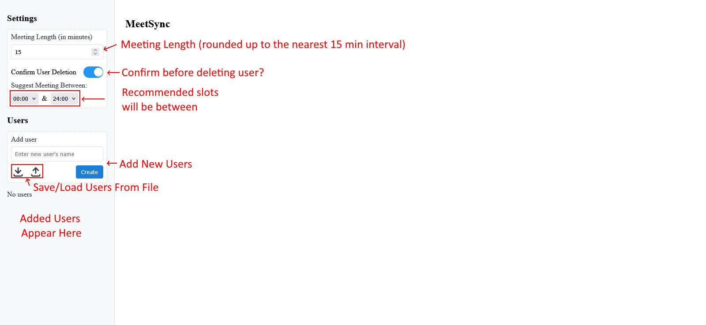
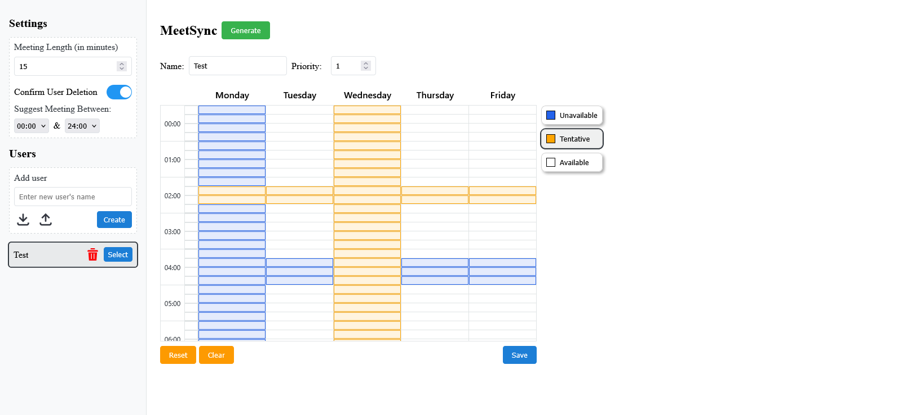
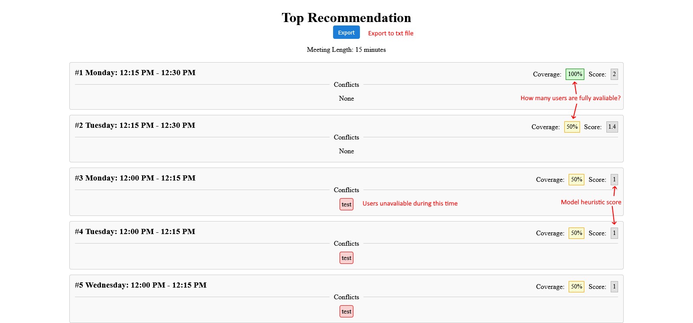

# MeetSync

## Hosted Demo Link

[Link](https://meetsync-l0t8.onrender.com)  
(May take a moment to spin up)

## Local Setup Instructions

### Using uv (Recommended)

[Astral's uv](https://docs.astral.sh/uv/) is a tool to manage and run Python applications. This is an external dependency and needs to be hinstalled separately. [Follow instructions here to install](https://docs.astral.sh/uv/getting-started/installation/).

(Open Command Prompt/Terminal within the project folder)

1. Install dependencies and set up the virtual environment:

   ```shell
   uv sync
   ```

2. Run the application:

   ```shell
   uv run fastapi run
   ```

### Using Python + pip

Before running the application, ensure you have Python 3.13 or higher installed, and `pip` is available and up to date. \
(Open Command Prompt/Terminal within the project folder)

1. Create and activate a virtual environment:

   ```shell
   python3 -m venv .venv
   #Windows
   source .venv/Scripts/activate
   #Mac/Linux
   source .venv/bin/activate
   ```

2. Install dependencies:

   ```shell
   pip install -r requirements.txt
   ```

3. Run the application:

   ```shell
   fastapi run
   ```

## Running the Application

Once started, the app will be available at [http://localhost:8000](http://localhost:8000) by default.

## Screenshots

### Initial View



### User View



### Error/Warning Popups


### Result Page



## Folder/File Structure

- `templates` — Jinja templates used to render views (e.g. `main.html.jinja`, `base.html.jinja`, `schedule.html.jinja`).

- `static` — Frontend assets (styles, scripts, images). Holds CSS under `styles/` and JS under `scripts/` (UI and client logic).

- `services` — Backend service modules and middleware logic (e.g. `transformer.py`). These provide logic used by the app's endpoints and background tasks.

- `main.py` — Application entry/host file (starts the FastAPI app or wiring for middleware/hosting).

- `model.py` — Heuristic model and supporting code used by the scheduler/transformer logic.

## Team

- Zachery Davis
- Brian Nguyen
- Ethan Pinto
- Smit Sakariya
- Brandon Sheng
